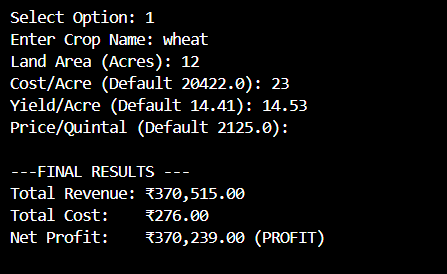
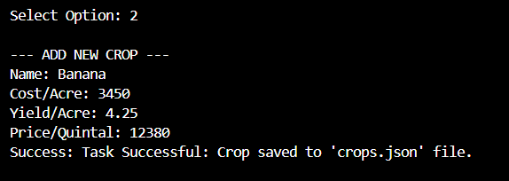
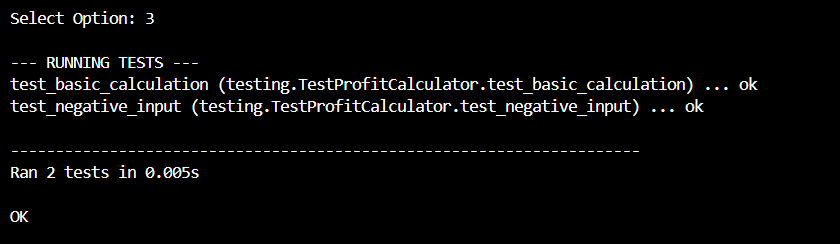
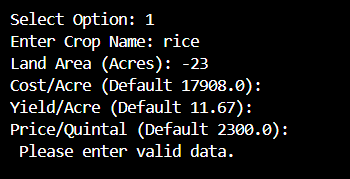

#  Crop Profit Prediction Calculator

## Overview

The **Crop Profit Prediction Calculator** is a simple decision-aiding tool specifically designed to assist farmers, agricultural consultants, and students in estimating the financial feasibility of various crops. By analyzing critical factors such as land area, expected yield per acre, cost of cultivation, and current market prices, this tool provides instant financial feedback. Designed to run entirely within the terminal, the application prioritizes speed and efficiency, requiring minimal system resources while delivering immediate, data-driven insights to aid in pre-cropping planning and risk assessment.

## Features

* **Calculates Profit:** Instantly calculates Total Revenue, Total Cost, and Net Profit based on your inputs. This helps you answer questions such as "Will I lose money if the price drops?"

* **Saves Your Data:** Automatically saves your custom crop details to a local file (crops.json). This means you don't lose your data even when you close the program i.e the data is stored for you forever.

* **Organized Code:** The project is split into different files (one for math, one for saving data, one for the menu) to make it clean and easy to understand.

* **Simple Menu System:** Uses a text-based menu that is easy to navigate. You just type numbers to choose options—no complicated graphics.

* **Built-in Checks:** Includes automated tests to make sure the math formulas are always correct.

## Technologies Used

* **Language: Python 3.x** (Compatible with Python 3.6 and newer).

* **Storage: JSON (JavaScript Object Notation)** via Python's built-in json library for portable, text-based data storage.

* **Testing:** Python’s standard **unittest** framework for rigorous code verification.

* **Dependencies:** Relies solely on the Python Standard Library, ensuring zero external installation requirements.

## Project Structure

```text
SRC/
├── main.py          # Entry point of the application (menu + user interaction)
├── corelogic.py         # Core business logic (profit-calculation formulas)
├── database.py      # Handles reading/writing the crops.json save file
├── fallback.py        # Stores default data if the save file is missing
├── test_project.py  # Test suite verifying calculations and logic
└── crops.json       # Automatically generated storage file for crop data

screenshots/         # Folder in the main directory containing images used in the README
```


## Installation & Usage

* **Install Python:** Ensure Python 3.x is installed on your system. You can verify the installation by typing python --version in your terminal.

* **Navigate to Code Folder:** Type this command to enter the source folder where the Python files are located:

                 cd SRC

* **Run the Application:** Execute the main script:

                 python main.py


* **Interact:**
The system presents a main menu with the following capabilities:

* * Select **Option 1** to calculate profit. You will be asked to enter values for Area, Cost, Yield, and Price. You may press 'Enter' to use stored defaults for a selected crop.

* * Select **Option 2** to add new crop definitions to the database. This allows you to expand the system's existing data with new crop types.

* *  Select **Option 3** to run system diagnostics (tests), which confirms that the internal math logic is performing correctly.
* * Select **Option 4** to Exit the program.

## Testing

To run the automated test suite directly without entering the main application menu, make sure you are inside the SRC folder and run:

                 python testing.py

## Screenshots


####   Main Menu


####  Core Calculation

#### CRUD Operations


#### Testing


#### Error Handling